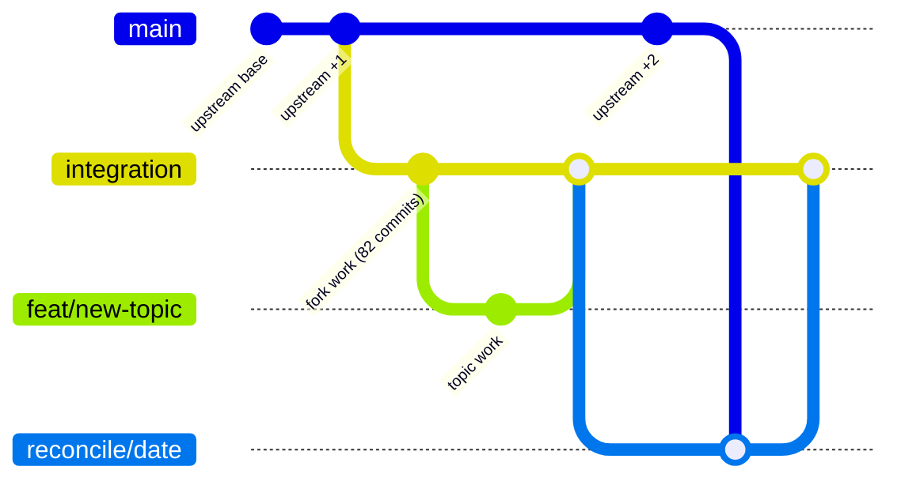
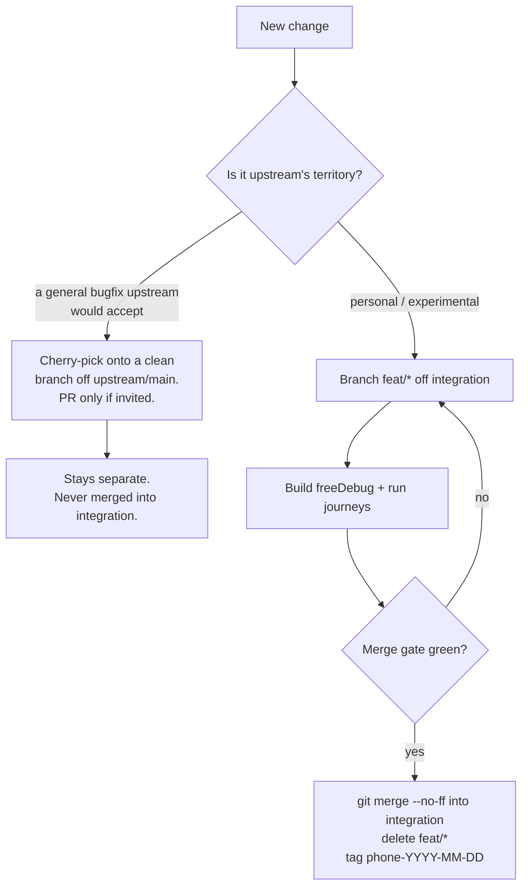
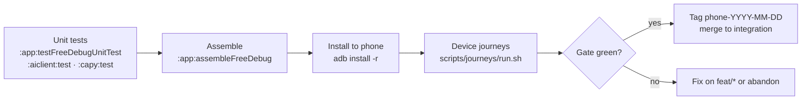

# CapyReader fork — maintenance strategy

Scope: keeping `joyearnaud/capyreader` (this fork) alive against
`jocmp/capyreader` (upstream), while shipping a personal Android build.

Decisions here are grounded in verified git state (see [Appendix A](#appendix-a--verified-state-2026-09-24)).
Re-verify before trusting anything dated.

---

## 1. Constraints that shape the model

| Constraint | Consequence |
| --- | --- |
| Upstream has **one** integration branch: `main`. Its 28 other heads are short-lived `jc/*` topic branches. There is **no `nightly` upstream**. | Follow `main`. There is no second channel to track. |
| Upstream ships releases from `main`; the app is a real product with a code-review policy. | Upstream is authoritative. The fork never invents its own base. |
| `README.md` / `AGENTS.md` forbid unsolicited PRs. | The fork is private by default. Contribute only cherry-picked, self-contained work, on request. |
| The fork's own build is what runs on a physical phone, and it is the only build that has the fork's features. | The integration branch must never be left mid-merge or broken — it is a deployable artifact, not a scratch pad. |
| `versionCode` is identical across branches (`1212`, `2026.07.1212`). | Version numbers cannot identify what is installed. Tags must. |
| Upstream moves continuously (~63 commits behind today). | Cost of divergence grows monotonically. Reconciliation is a recurring ritual, not an event. |

---

## 2. Branch model

Three branch classes, three lifetimes. Nothing else.

| Branch | Lifetime | Rule |
| --- | --- | --- |
| `main` | forever | **Mirror of `upstream/main`. Fast-forward only. Never commit to it.** |
| `integration` | long-lived | The fork's integration line. Advances **only by merge** (from `feat/*` or `reconcile/*`). This is what gets built and installed. |
| `feat/<topic>` | days | Short-lived work off `integration`. Merged in, then deleted. |
| `reconcile/<date>` | hours | Throwaway scratch for an upstream merge. Validated, fast-forwarded into `integration`, deleted. |

> **Why `integration`.** The branch previously carried the name of one of its own features
> (`list-summary`) — which is exactly the mislabelling that let it be treated as a feature branch
> instead of as the fork's shipping line. Its role is not one feature: it carries four unrelated
> workstreams and will outlive all of them. Renamed `list-summary` → `integration` in 2026-10
> (same commit; `origin/integration` pushed, `origin/list-summary` deleted afterwards).

### 2.1 Topology



The same topology, without renderer assumptions:

```
  upstream/main ──●───●───────●───────●──────●──►   moves continuously
                   \     \       \       \
  origin/main   ────●─────●───────●───────●───●──►   ff-only mirror

                       fork base = origin/nightly @ 2026-07-21
                             │
  integration  ─────────────●───●───●───●───●───●──►   install target
                              \       ↑       \   ↑
                   feat/xyz    ●───────┘        \  │
                (merged, deleted)                \ │  merge --ff-only
                               reconcile/2026-09-24
                               (scratch + validation, deleted)
```

### 2.2 Where does a change go?



**Why cherry-pick for upstream-bound work.** Anything merged into `integration` inherits 82
commits of unrelated fork history. A patch built on that line can never be proposed upstream.
Keeping upstream-bound work on a clean branch off `upstream/main` preserves the option to
contribute without rewriting history later.

---

## 3. Cadence

The three rituals, and why each exists.

| Ritual | Trigger | Cost if skipped |
| --- | --- | --- |
| **Mirror `main`** | weekly, or before any reconciliation | `main` stops being a trustworthy baseline; merges get judged against a stale reference |
| **Reconcile** | every 1–2 weeks, or on an upstream release that touches your hotspots | Conflicts compound; a 3-week gap is 3 separate conflict resolutions in the same files |
| **Tag the phone build** | every install | You cannot answer "what is on my phone?" — `versionCode` is not discriminating |

**Reconcile early on navigation/reader churn.** Upstream merged the Jetpack Navigation 3 migration
(#2197), which rewrites the navigation graph — exactly the code the fork's reader and digest
screens touch. Treat any upstream commit touching navigation, the reader, or the article list as an
unscheduled trigger for reconciliation.

---

## 4. Runbook

Every command is copy-pasteable. `--ff-only` is not decoration: it is what makes the invariant
"nothing merges into `main`" mechanically enforced instead of a promise.

### 4.1 Mirror `main` (ff-only)

```bash
git fetch upstream --prune
git checkout main
git merge --ff-only upstream/main      # fails loudly if main ever diverged
git push origin main
```

### 4.2 Start a topic

```bash
git checkout integration && git pull --ff-only
git checkout -b feat/<topic>
# ... work, commit ...
```

### 4.3 Reconcile with upstream

Gated by build + device validation. **Never** let the merge land on `integration` before the
gate is green — the branch builds the APK on the phone.

```bash
# 0. preconditions
git status --short                       # must be clean
git fetch upstream --prune

# 1. scratch branch
git checkout -b reconcile/$(date +%Y-%m-%d) integration
git merge upstream/main                  # resolve conflicts HERE

# 2. gate — build and run the app
mise exec java@zulu-21.34.19.0 -- ./gradlew \
  -Dorg.gradle.jvmargs="-Xmx4g -Dfile.encoding=UTF-8" \
  -Dkotlin.daemon.jvmargs="-Xmx3g" \
  :app:testFreeDebugUnitTest :app:assembleFreeDebug
adb install -r app/build/outputs/apk/free/debug/*.apk
scripts/journeys/run.sh                  # 1 launch · 2 article · 3 digest · 4 summaries · 5 mark-read

# 3. only if green
git checkout integration
git merge --ff-only reconcile/$(date +%Y-%m-%d)
git branch -D reconcile/$(date +%Y-%m-%d)

# 4. record and publish
git tag phone-$(date +%Y-%m-%d)
git push origin integration --tags
```

If the gate is red and the conflict is not worth resolving today, the scratch branch is the exit:
`git checkout integration && git branch -D reconcile/<date>`. Nothing was lost, `integration`
never saw a bad state.

### 4.4 Publish the phone build

```bash
git push -u origin integration          # FIRST BACKUP — see §7
git tag -a phone-$(date +%Y-%m-%d) -m "build validated on phone"
git push origin --tags
```

### 4.5 Build invariants

- **Always the `free` flavor**: `assembleFreeDebug`. `gplay` is the *default* flavor and fails
  without `google-services.json`. Never run bare `assembleDebug`.
- Always through `mise exec java@zulu-21.34.19.0` — the toolchain pin lives in the mise config, not
  in the repo.
- Debug package is `com.capyreader.app.debug`; the journey harness targets exactly that.

---

## 5. Conflict hotspots

Inferred from the fork's commit subjects and upstream's merge titles — audit before each
reconciliation, do not assume.

| Hotspot | Why it collides | Mitigation |
| --- | --- | --- |
| **Navigation graph** | Fork carries tab/sheet navigation and screen wiring; upstream migrated to Jetpack Navigation 3 (#2197) | Merge this first, alone, on its own reconcile branch. Do not bundle with feature work. |
| **Article list / reader** | Fork replaced the WebView reader with a native renderer (`mercury-parser-kt`, `mallet` module) | Keep the renderer behind a single seam. If upstream refactors the reader, decide once: adopt upstream's shape, or keep the fork's and take the conflict. |
| **Digest / Summaries** | Pure fork invention (`:aiclient`, digest sheet, 3-day memory) | Lowest collision risk. If it ever conflicts, the fork owns the resolution. |
| **Scroll restore** | Touches the list and the pager — the same files as upstream's list work | Prefer upstream's list structure; re-apply the restore fix on top rather than re-fighting. |

**Ritual for a painful merge.** Resolve on `reconcile/*`. If a conflict reveals that the fork's
version is a deliberate divergence, record it in §8 rather than re-deciding it silently every
merge.

---

## 6. Build & validation pipeline

Three gates, cheapest first. A change reaches `integration` only past all three.



**Honesty about the harness.** `scripts/journeys/run.sh` asserts only two things automatically:
no crash (logcat) and the unread-badge delta in journey 5. UI Automator dumps are unreliable on
Compose windows and are deliberately not used for assertions — **the screenshots are the
validation artifact**. That means someone must look at them. A run that aborts (the app leaves the
foreground mid-journey) proves nothing and must be re-run, not interpreted as a pass.

---

## 7. Backup and identity

**The integration line is backed up.** `integration` is pushed and tracks `origin/integration`.
This branch is the only build that carries the fork's features and the one installed on the phone,
so it must never exist on a single machine.

```bash
git push -u origin integration          # done 2026-10; re-run after every merge
```

> **Correction (2026-10).** An earlier revision of this document claimed the line had never been
> pushed. That was wrong: `origin/list-summary` existed at the identical commit. The local branch
> simply had no upstream *tracking* configured, and `git branch -vv` renders that as a blank
> column, which reads as "not pushed". **Verify with `git ls-remote --heads origin`, never with the
> tracking column.**

**Identity of an installed build.** `versionCode` `1212` / `versionName` `2026.07.1212` is identical
on every branch — it cannot tell you what is on the phone. Use annotated tags:

```bash
git tag -a phone-2026-09-24 -m "digest sheet + summaries validated on device"
git describe --tags --exact-match    # what is checked out
```

**Artifact hygiene.** `device-journeys/<timestamp>/` holds screenshots and a `report.md` per run.
It is currently untracked noise. It should be gitignored — screenshots are per-run evidence, not
source:

```gitignore
# device journey run artifacts (scripts/journeys/run.sh output)
/device-journeys/
```

The harness itself (`scripts/journeys/`) stays tracked. If a run produces a decision worth
keeping, promote its `report.md` into `docs/fork/journeys/` deliberately.

---

## 8. Decisions (ADR log)

Recorded so they are not silently re-litigated at every merge.

| # | Decision | Rationale | Revisit when |
| --- | --- | --- | --- |
| D1 | `main` mirrors `upstream/main`, ff-only | Gives one unambiguous reference to merge against | never |
| D2 | Follow `main`, drop the `nightly` channel | Upstream has no `nightly` branch; the fork's is a stale 2026-07-21 leftover | upstream reintroduces nightly |
| D3 | `integration` is an integration line, not a feature branch | 4 unrelated workstreams, long-lived, deployable | the fork is abandoned or rebased as a single patch series |
| D4 | Reconciliation branch only for big/conflicting merges | Content is identical to merging directly; the value is that the deployable branch never enters a broken state | merges become trivial weekly |
| D5 | Merge upstream, never rebase the fork line | Rebasing 82 commits rewrites history and invalidates every tag | the line is rebuilt as a small patch series |
| D6 | Cherry-pick upstream-bound work onto a clean branch off `upstream/main` | Keeps the option to contribute without rewriting history | never |
| D7 | Never rewrite history to purge `origin/nightly` | It is already an ancestor of `upstream/main`; one merge makes it irrelevant | never |

---

## 9. Guardrails

Never:

1. **Commit on `main`.** Use `--ff-only` so it is mechanically impossible.
2. **Leave `integration` mid-merge.** Do the merge on `reconcile/*`; it is the deployable branch.
3. **`rebase` `integration`.** Tags and any future branch base point at its commits.
4. **Run plain `assembleDebug`.** It resolves to the `gplay` flavor and fails.
5. **Delete `origin/nightly` before the first reconciliation.** After it, removing it is safe.
6. **Open a PR upstream unprompted.** `AGENTS.md` and `README.md` forbid it; reach out privately
   first.
7. **Trust a `versionCode` to identify a phone build.** Use tags.

Always:

1. **Keep `integration` pushed.** It is the only copy of the fork's features outside this machine.
2. **Merge upstream first, feature work second.** Never mix the two in one merge commit.
3. **Run the journey harness before promoting a merge** to `integration`.
4. **Re-read screenshots.** The harness asserts almost nothing automatically.

---

## 10. Immediate actions

Ordered by risk.

| # | Action | Command | Why now |
| --- | --- | --- | --- |
| ~~1~~ | ~~Back up the integration line~~ | **done 2026-10** | `origin/list-summary` already existed; the real gap was the missing upstream tracking, fixed by the rename to `integration` |
| ~~2~~ | ~~Silence journey noise~~ | **done 2026-10** | `/device-journeys/` added to `.gitignore`; 30+ untracked entries per run no longer pollute `git status` |
| 3 | Re-run the aborted journey | `scripts/journeys/run.sh` | the 2026-09-23 run aborted at step 4 — that state is unvalidated |
| 4 | Mirror `main` | §4.1 | 86 commits behind; cheap and reversible |
| 5 | First reconciliation | §4.3 | 63 commits behind and growing; Navigation 3 will only get harder |
| 6 | Retire `origin/nightly` | `git push origin --delete nightly` | dead end; safe **after** step 5 |

---

## Appendix A — verified state (2026-09-24)

```
origin   git@github.com:joyearnaud/capyreader.git   (fork, 26 heads)
upstream https://github.com/jocmp/capyreader.git    (original, 29 heads: main + 28 topic branches)
```

| Ref | Commit | Date | Note |
| --- | --- | --- | --- |
| `upstream/main` | `b4b47c10` | 2026-09 | "Keep E Ink immersive mode across articles (#2283)" |
| `origin/main` | `6aa1ddfd` | 2026-08-02 | "Clamp scroll high water mark to list size (#2215)" |
| `main` (local) | `6aa1ddfd` | 2026-08-02 | **86 behind `upstream/main`**, ancestor of it → ff-only possible |
| `integration` (local) | `75c485e4` | 2026-09-23 | **83 ahead of `main`**, 60 ahead / 63 behind `upstream/main`; tracks `origin/integration`; renamed from `list-summary` in 2026-10 |
| `origin/nightly` | `d75ad0b9` | 2026-07-21 | 0 ahead / 85 behind `upstream/main` — stale, ancestor of the fork line |

Workstreams carried by `integration` (82 non-merge commits since the nightly base):

1. Native reader replacing the WebView (`mercury-parser-kt`, `mallet` module, YouTube embeds)
2. AI digest / Summaries (`:aiclient`, digest sheet, 3-day memory, browse screen)
3. Scroll-position restore (list → article → back)
4. adb device journey harness (`scripts/journeys/`)

Build facts: `applicationId com.capyreader.app`, debug suffix `.debug`, `versionCode 1212`,
`versionName 2026.07.1212`. Default flavor `gplay` fails without `google-services.json`.
Journey harness asserts only crashes and the journey-5 badge delta; screenshots are the artifact.

Last journey run `device-journeys/20260923-162340/` — 3 journeys passed, **ABORTED at step 4**
(app left the foreground).
